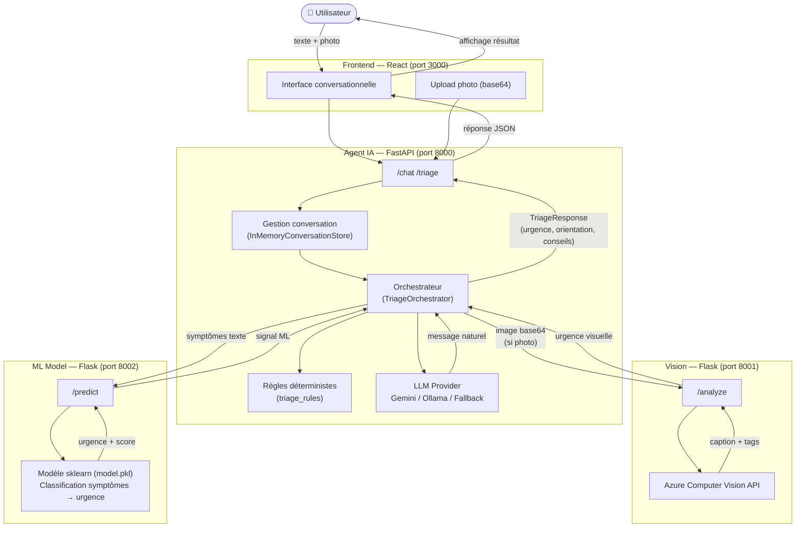
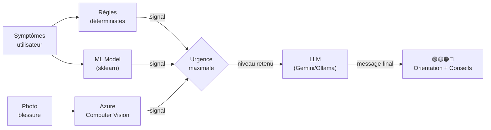

# 🏥 MedTriageAI — Assistant intelligent de triage médical

> Projet Azure — EPITA | Équipe de 4

---

## 📋 Description

MedTriageAI est une application web permettant à un utilisateur de décrire ses symptômes (texte et/ou photo) et d'obtenir instantanément une orientation médicale personnalisée, un niveau d'urgence et des conseils adaptés.

**Problématique** : En France, une part significative des passages aux urgences est non urgente. Les gens ne savent pas toujours s'ils doivent appeler le 15, aller chez le médecin ou simplement passer à la pharmacie.

---

## 🎯 Use Cases

| # | Use Case | Description |
|---|---|---|
| 1 | **Triage par symptômes** | L'utilisateur décrit ses symptômes en texte libre → l'agent analyse et retourne un niveau d'urgence + orientation |
| 2 | **Analyse visuelle** | L'utilisateur envoie une photo d'une blessure/rougeur → Azure Computer Vision évalue la gravité visuelle |
| 3 | **Dialogue conversationnel** | L'agent pose des questions complémentaires pour affiner l'orientation médicale |

---

## 🏗️ Architecture MVP



### Flux de décision



### Structure des dossiers

```
medtriage-ai/
├── frontend/      # React + Vite + Tailwind (port 3000)
├── agent/         # FastAPI + Microsoft Agent Framework (port 8000)
├── vision/        # Flask + Azure Computer Vision (port 8001)
├── ml-model/      # Flask + sklearn (port 8002)
├── docker-compose.yml
└── README.md
```

---

## 🔧 Stack technique

| Composant | Technologie |
|---|---|
| Interface | React ou Streamlit |
| Agent IA | Microsoft Agent Framework + Gemini / Ollama |
| Vision | Azure Computer Vision |
| ML | Azure Machine Learning |
| Déploiement local | Docker |

---

## Ports locaux

| Service | Port | URL |
|---|---:|---|
| Frontend | 3000 | `http://localhost:3000` |
| Agent IA | 8000 | `http://localhost:8000` |
| Computer Vision | 8001 | `http://localhost:8001` |
| ML Model | 8002 | `http://localhost:8002` |

---

## ✅ Mapping Azure tracks

| Track | Implémentation |
|---|---|
| **(1) Cognitive / Computer Vision** | Analyse photo blessure ou symptôme visuel |
| **(2) Edge / Docker local** | App containerisée, fonctionne hors-ligne |
| **(3) Azure Machine Learning** | Classification symptômes sur dataset médical |
| **(4) Agentic** | Agent orchestrant les 3 composants ci-dessus |

---

## 🚀 Lancer le projet

### Prérequis

```bash
# Cloner le repo
git clone https://github.com/<votre-org>/medtriage-ai.git
cd medtriage-ai
```

### Frontend

```bash
cd frontend
npm install
npm run dev
```

### Agent

```bash
cd agent
pip install -r requirements.txt
python main.py
```

### Vision

```bash
cd vision
pip install -r requirements.txt
python app.py
```

### Docker (Edge)

```bash
cd docker
docker-compose up --build
```

---

## 📡 Interface commune (contrat entre modules)

```json
// Input vers l'agent
{
  "symptomes": "fièvre 39°C, mal à la gorge depuis 2 jours",
  "photo_base64": "..."
}

// Output de l'agent
{
  "urgence": "orange",
  "orientation": "médecin généraliste",
  "delai": "sous 24h",
  "conseils": ["Boire beaucoup d'eau", "Prendre du paracétamol"]
}
```

---

## 📄 Licence

Projet académique — EPITA
